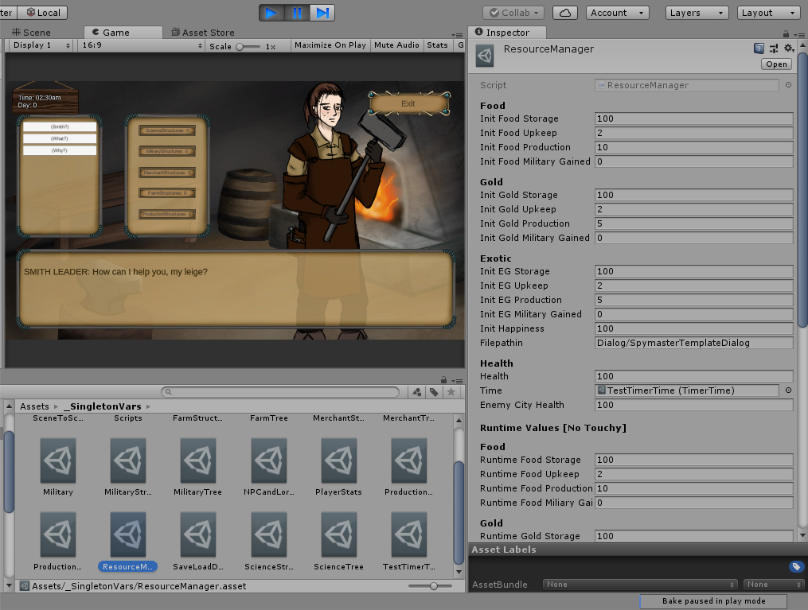
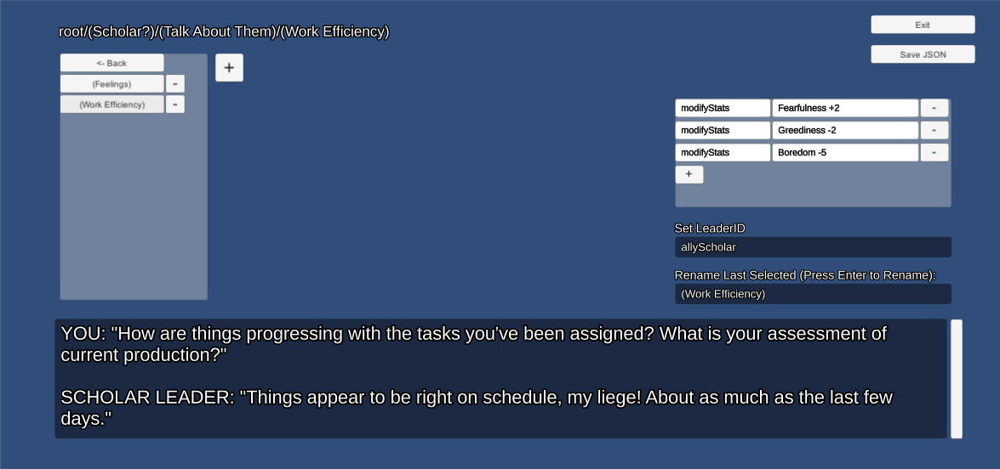
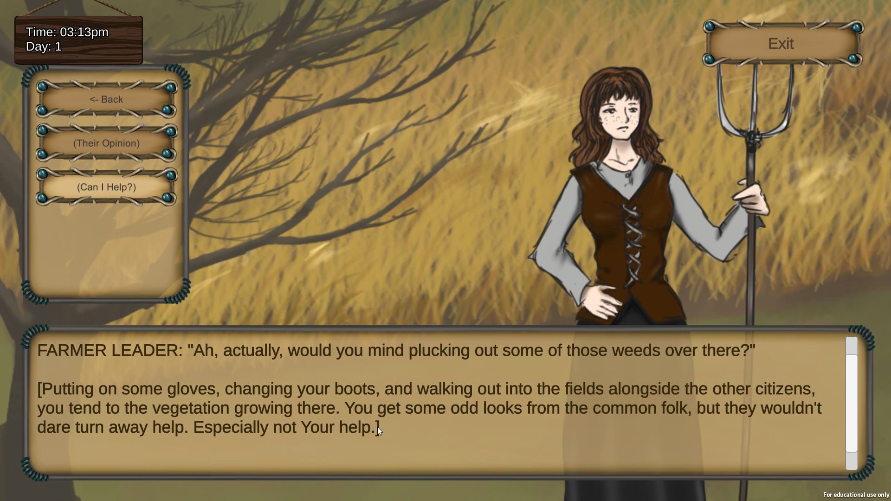

Ministrare is a strategy game created as a RIT Production Studio group project based around the concept of "strategic communication." I acted as the lead programmer
and engineer on the project and created several core systems including game state management, in-game UI and content editor tools.

# Architecture

The overall architecture of the project is based on an adaptation of [Ryan Hipple/Schell Games' use of ScriptableObjects as manager-less global data stores.](https://www.youtube.com/watch?v=raQ3iHhE_Kk)
Each scene in the game, including the dialog scenes, the map scene, and others are set up to read and write all important data relevant to the current game state from these global data stores.
This allow scenes to be cleanly separated by pieces of functionality instead of having a single overengineered scene that would handle all individual pieces of functionality.

    <em>Example of a ScriptableObject used to store game state</em>

# Dialog and Events Editor

In order for the project's 2 writers to create various conversations and responses in the game, I created a set of dialog editor tools.
These tools allow the writers to create dialog topics, conversations, nodes, and in-game events that were triggered based on when certain conditions
in conversations were met.

    <em>Screenshot of the dialog editor UI I developed</em>

The dialog editor exported dialog trees as JSON files, which were then read at run time in the engine. Reading the dialog as JSON
allowed our writers to work on conversations and test them in production while other systems in the game were being developed, allowing the
team to create a large quantity of content within the 14 week development cycle.

    <em>Dialog creation process. Editor -> JSON -> In game</em>

    <em>Screenshot of in-game UI running a dialog tree</em>

