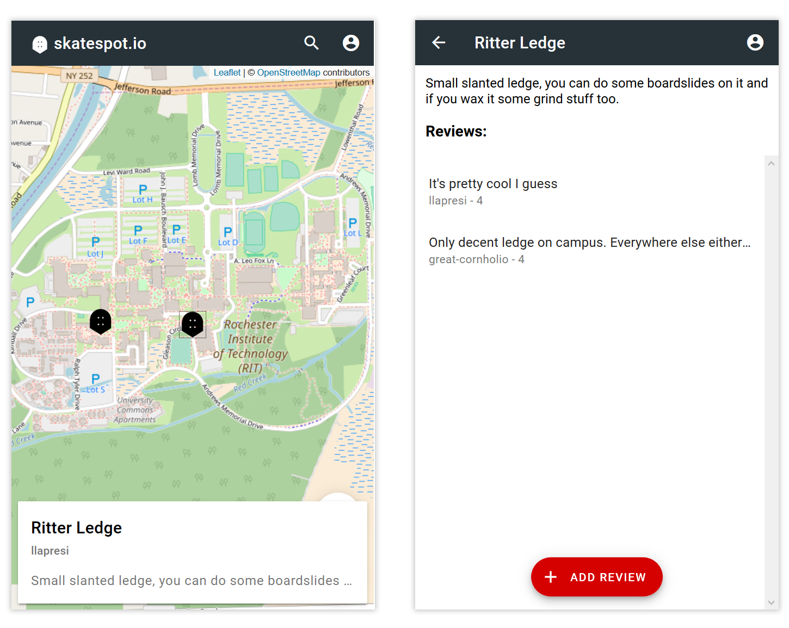
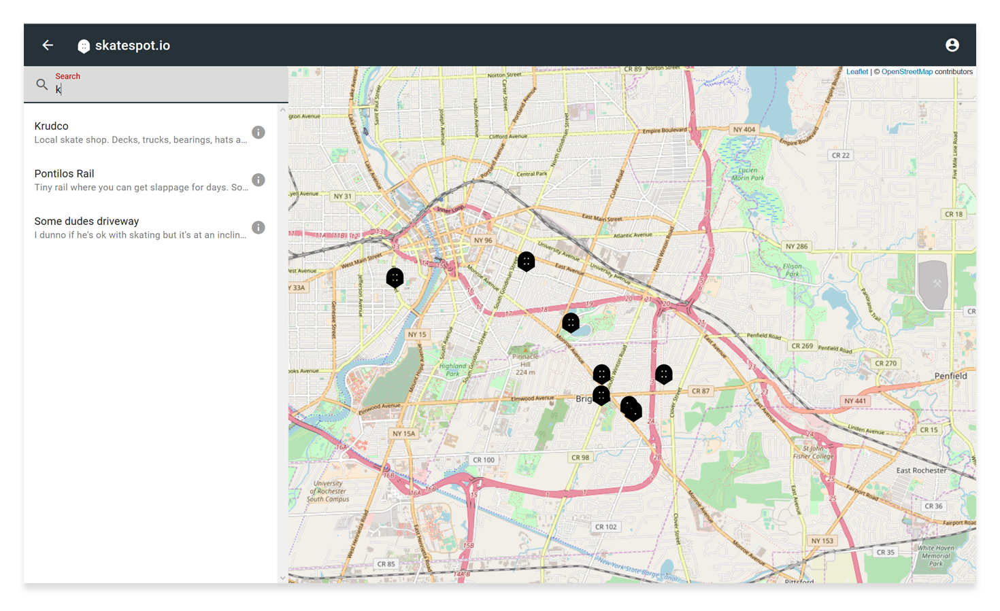

Skatespot.io is a Full Stack Web App that allows skateboarders to find and add points of interest, including spots, parks, stores and more.

### [Checkout skatespot.io on GitHub](https://github.com/llapresi/skatespot.io)
### [Try it out on the skatespot.io demo server](https://skatespot-demo.herokuapp.com)

    <em>Skatespot.io's main map view and spot detail view</em>

Skatespot's core screen provides an overhead map with user-placed points of interest overlayed. Tapping on one of these points shows an info card on the bottom of the screen showing an overview of the spot in question.

The search icon in the toolbar allows the user to search the entire database for various spots outside their
geolocated position.

    <em>On a desktop screen, the search bar becomes a side panel</em>

# Technologies

Skatespot.io's front end is built using modern JavaScript, React, React Router, and Webpack, allowing for seamless transitions
between dynamic screens. The back end uses Node.js, Express, MongoDB and Mongoose to create a database that allows users to add and search for
points of interest alongsides comments and other users.

Skatespot.io is a Progressive Web App, caching the main app shell using the Service Workers API if the user adds it to their mobile home screen.
This allows the app's initial startup time to be sped up dramatically  
